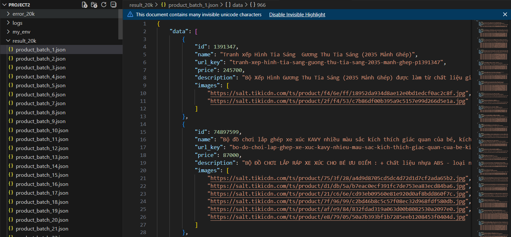

# Get API Project2

Both requests and aiohttp packages are using for creating product JSON files. Scripts in `/src` and results in `/results` folder.

## I. Install packages

Get into python environment (activate), open CMD and using pip:

- pip install requests
- pip install aiohttp
- pip install bs4

## II. Example of a batch of JSON product list file:
```swift
{
  "data": [{object 1}, {object 2},... {object n}]
}
```



